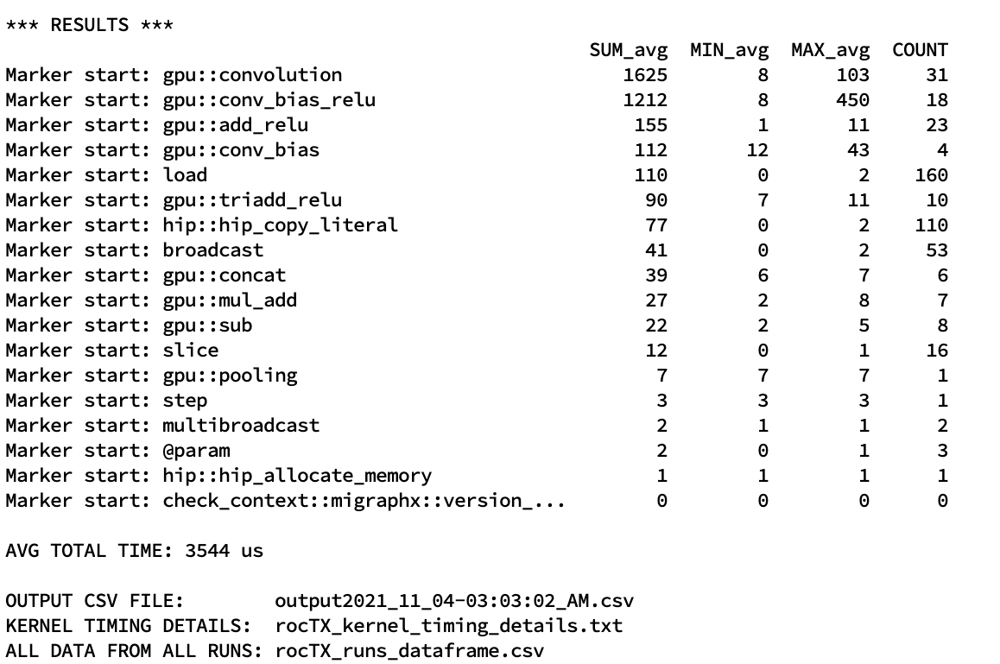

MIGraphX Driver
===============

read
----

.. program:: migraphx-driver read

Loads and prints input graph.

.. include:: ./driver/read.rst

compile
-------

.. program:: migraphx-driver compile

Compiles and prints input graph.

.. include:: ./driver/compile.rst

run
---

.. program:: migraphx-driver run

Loads and prints input graph.

.. include:: ./driver/compile.rst

perf
----

.. program:: migraphx-driver perf

Compiles and runs input graph then prints performance report.

.. include:: ./driver/compile.rst

.. option::  --iterations, -n [unsigned int]

Number of iterations to run for perf report (Default: 100)

verify
------

.. program:: migraphx-driver verify

Runs reference and CPU or GPU implementations and checks outputs for consistency.

.. include:: ./driver/compile.rst

.. option::  --tolerance [double]

Tolerance for errors (Default: 80)

.. option::  -i, --per-instruction

Verify each instruction

.. option::  -r, --reduce

Reduce program and verify

roctx
----

.. program:: migraphx-driver roctx

Provides marker information for each operation, allowing MIGraphX to be used with `rocprof <https://rocmdocs.amd.com/en/latest/ROCm_Tools/ROCm-Tools.html>`_ for performance analysis.
This allows user to get GPU-level kernel timing information.
An example command line combined with rocprof for tracing purposes is given below:

::

    /opt/rocm/bin/rocprof --hip-trace --roctx-trace --flush-rate 1ms --timestamp on -d <OUTPUT_PATH> --obj-tracking on /opt/rocm/bin/migraphx-driver roctx <ONNX_FILE> <MIGRAPHX_OPTIONS>

After `rocprof` is run, the output directory will have many files which needs to be processed. In order to ease the processing output files,  **a helper script** is provided at `/tools/roctx.py`.
The `roctx.py` helper script provides two main functionality: `run` and `parse`. Available knobs and usage are given below:

::

    Usage: roctx.py [-h] [--json-path json_path] [--out out]
    [--study-name study-name] [--repeat repeat] [--parse]
    [--run run] [--debug]

.. option::  --run

Runs MIGraphX with rocTX and given MIGraphX knobs, and parses the results, providing GPU kernel timing information.
MIGraphX knobs can be given via a string to `--run` knob. Please see the examples below.

.. option::  --parse

Given `--json-path`, parses JSON file and provides GPU kernel timing information.

.. option::  --out

Output folder

.. option::  --study-name

Optional. Allows user to name a study for easier interpretation. Defaults to timestamp.

.. option::  --repeat

Number of iterations. Set to **2** by default.

.. option::  --debug

Provides additional debug information related to data. Only use for debugging purposes.

**Examples:**

**Running inference with rocTX for a given ONNX file:**
::
    python roctx.py --run '--onnx --gpu ../../../AMDMIGraphX/fcn-resnet50-11.onnx' --out output_folder --repeat 5

After a run, similar to output given below is expected at terminal. The output will provide `SUM`, `MIN`, `MAX` and `COUNT` information for each kernel executed for a given model.
Average total time is also provided. There are three files provided for reference:

1. `OUTPUT CSV FILE` provides a summary of the run, providing utilized MIGraphX knobs and related kernel timing information
2. `KERNEL TIMING DETAILS` provides the hotspot kernel timing information
3. This will provide all output data related to all iterations executed during a run.

An example output:

Hotspot kerel timing information:

.. image:: ./driver/roctx2.jpg

**Parsing an already existing JSON file:**
::

    python roctx.py --parse --json_path ../trace.json
