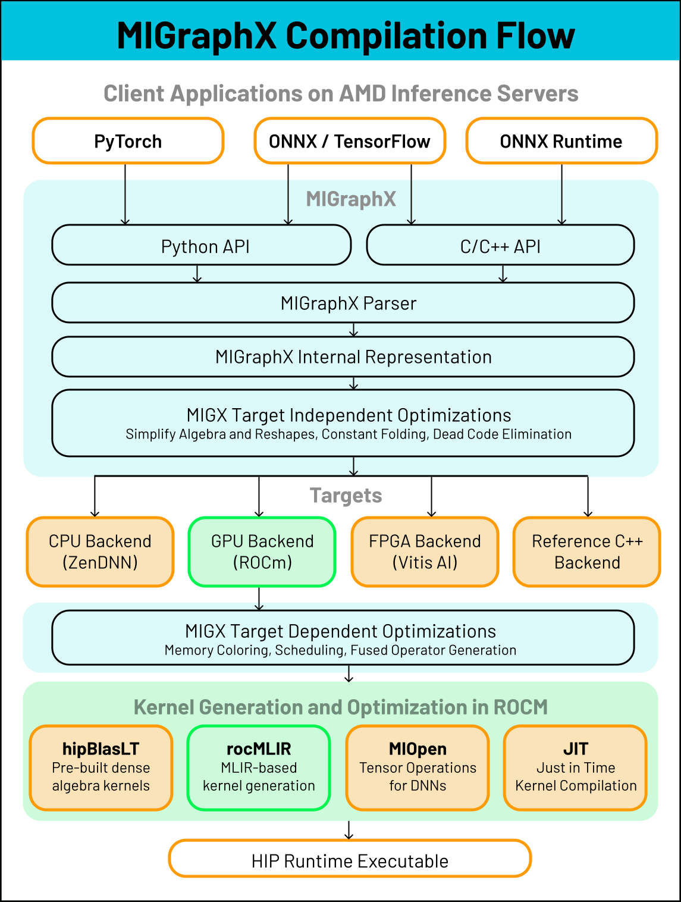
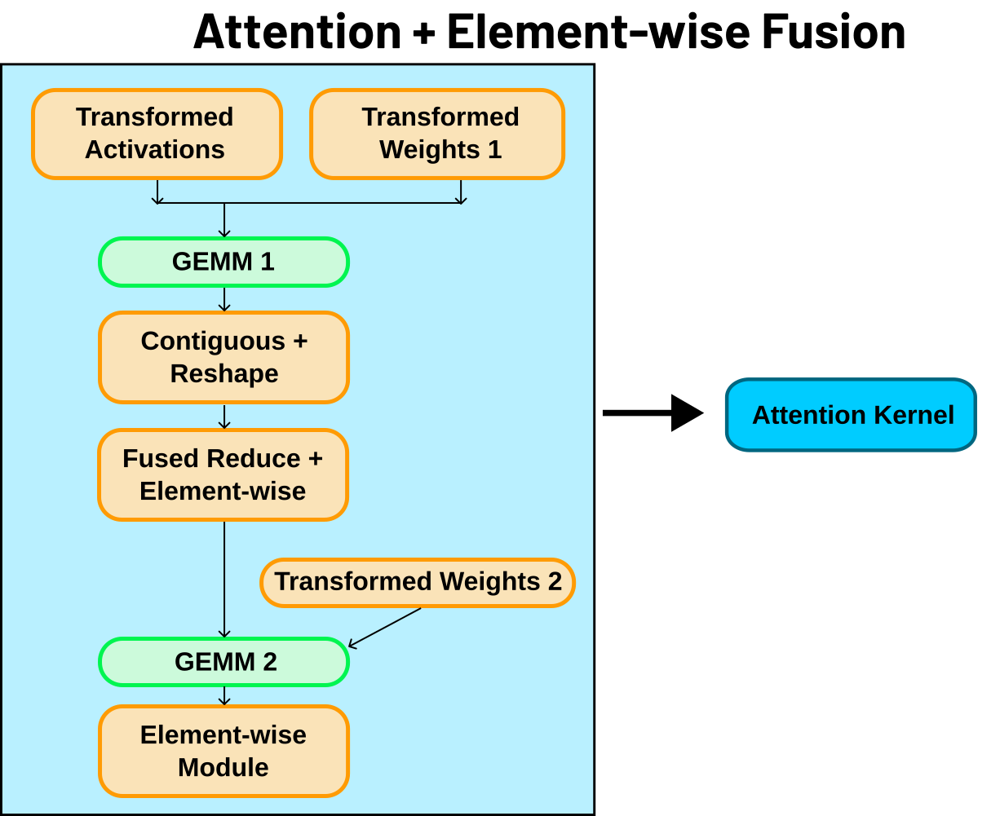

.. meta::
  :description: Deep learning compilation with MIGraphX
  :keywords: MIGraphX, ROCm, library, API

.. _deep-learning-compilation:

********************************************************************
Deep learning compilation with MIGraphX
********************************************************************

The MIGraphX deep learning (DL) compiler improves inference by analyzing 
a model’s compute graph and applying program transformations. After 
optimization, the compiler lowers graph operations to device kernels (from 
libraries or via code generation) for efficient execution.

A common transformation is kernel fusion; where compatible operations are 
merged into a single kernel launch. Fusion reduces launch overhead and 
avoids extra reads or writes between host and device, which typically 
improves latency and throughput. By applying graph-level optimizations 
and choosing or generating efficient device kernels, MIGraphX delivers 
high-performance over uncompiled models and less optimized compiled solutions.

An overview of the compilation process for MIGraphX is shown below in 
:numref:`compilation-label`. One type of optimization that MIGraphX 
performs are kernel fusions such as the Attention fusion seen in 
:numref:`attention-label`.

What MIGraphX provides
====================================================================

* **End-to-end:** compilation and execution of DL models on AMD GPUs
* **C++ implementation:** with Python and C++ APIs
* **Model inputs:**
    * ONNX and TensorFlow
    * PyTorch through `https://github.com/ROCm/torch_migraphx <https://github.com/ROCm/torch_migraphx>`__
    * ONNX Runtime execution provider
* **Hardware targets:** AMD Navi (consumer) and MI (server) GPUs
* **Supported data types:** FP16, BF16, OCP FP8, INT8, INT4

