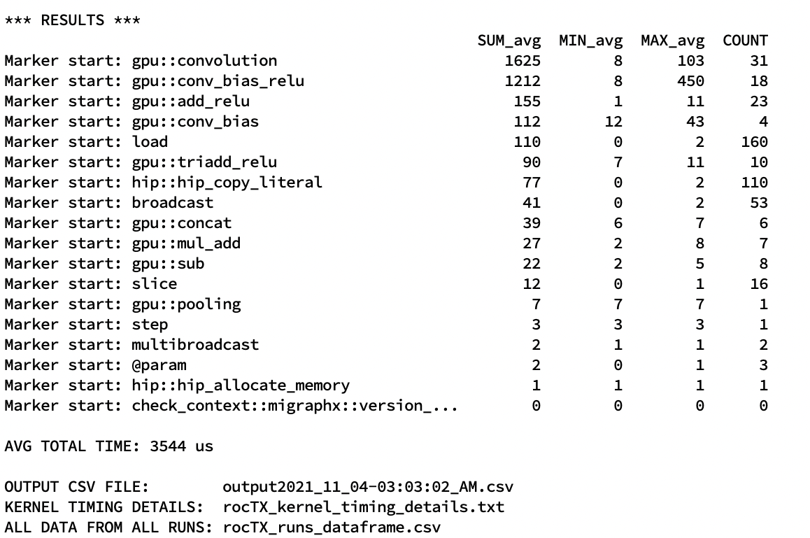

.. _tools:

Tools
=====

roctx.py
--------
MIGraphX driver provides `roctx` command which can be used with `rocprof` binary to get marker timing information for each MIGraphX operator.  
In order to help user to process timing information, rocTX helper script is provided at `tools/roctx.py`.
The `roctx.py` helper script provides two main functionality: `run` and `parse`. Available knobs and usage are given below:

::

    Usage: roctx.py [-h] [--json-path json_path] [--out out]
    [--study-name study-name] [--repeat repeat] [--parse]
    [--run run] [--debug]

.. option::  --run

Runs `migraphx-driver roctx` command and given `migraphx-driver` knobs, and then parses the results, providing GPU kernel timing information.
MIGraphX knobs can be given via a string to `--run` knob. Please see the examples below.

.. option::  --parse

Given `--json-path`, parses JSON file and provides GPU kernel timing information.

.. option::  --out

Output folder

.. option::  --study-name

Optional. Allows user to name a study for easier interpretation. Defaults to timestamp.

.. option::  --repeat

Number of iterations. Set to **2** by default.

.. option::  --debug

Provides additional debug information related to data. Only use for debugging purposes.

**Examples:**

**Running inference with rocTX for a given ONNX file:**
::
    python roctx.py --run '--onnx --gpu fcn-resnet50-11.onnx' --out output_folder --repeat 5

After a run, similar to output given below is expected at terminal. The output will provide `SUM`, `MIN`, `MAX` and `COUNT` information for each kernel executed for a given model.
Average total time is also provided. There are three files provided for reference:

1. `OUTPUT CSV FILE` provides a summary of the run, providing utilized MIGraphX knobs and related kernel timing information
2. `KERNEL TIMING DETAILS` provides the hotspot kernel timing information
3. This will provide all output data related to all iterations executed during a run.

An example output:

Hotspot kerel timing information:

.. image:: ../data/roctx2.jpg

**Parsing an already existing JSON file:**
::

    python roctx.py --parse --json-path ../trace.json
