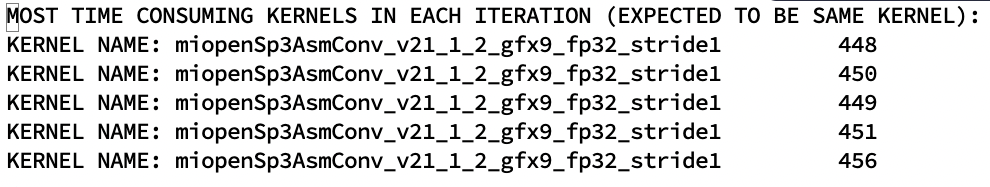

.. _tools:

Tools
=====

roctx.py
--------
You can use the :ref:`roctx` command with `rocprof` binary to get marker timing information for each MIGraphX operator.  
To process timing information, use :ref:`roctx.py <tools>` helper script.

::

    Usage: roctx.py [-h] [--json-path json_path] [--out out]
    [--study-name study-name] [--repeat repeat] [--parse]
    [--run run] [--debug]

The :ref:`roctx.py <tools>` helper script provides two main functionalities: `run` and `parse`.

.. option::  --run

Runs `migraphx-driver roctx` command with the given `migraphx-driver` knobs followed by the parsing of the result which provides GPU kernel timing information.
You can pass the MIGraphX knobs via a string to `--run` knob. See the :ref:`_roctx-examples` for usage.

.. option::  --parse

Parses JSON file in the given `--json-path` and provides GPU kernel timing information.

.. option::  --out

Output folder

.. option::  --study-name

Optional. Allows user to name a study for easy interpretation. Defaults to timestamp.

.. option::  --repeat

Number of iterations. Sets to **2** by default.

.. option::  --debug

Provides additional debug information related to data. Use for debugging purposes only.

.. _roctx-examples:

**Examples:**

**Running inference with rocTX for a given ONNX file:**
::
    python roctx.py --run '--onnx --gpu fcn-resnet50-11.onnx' --out output_folder --repeat 5

Example output:

.. image:: ../data/roctx1.jpg

Hotspot kerel timing information:

The output provides `SUM`, `MIN`, `MAX` and `COUNT` information for each kernel executed for a given model. It also
provides the average total time. The following three files are provided for reference:

-   OUTPUT CSV FILE: Provides a summary of the run which includes utilized MIGraphX knobs and related kernel timing information.
-   KERNEL TIMING DETAILS: Provides the hotspot kernel timing information.
-   ALL DATA FROM ALL RUNS: Provides all output data related to all iterations executed during a run.

**Parsing an existing JSON file:**
::

    python roctx.py --parse --json-path ../trace.json
