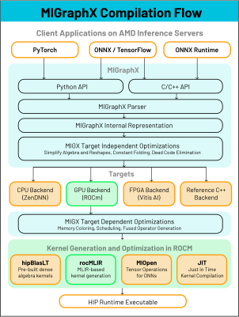
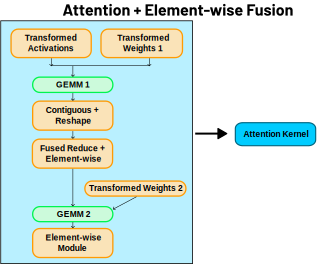

.. meta::
   :description: MIGraphX: optimized graph compiler and execution engine for deep learning neural networks
   :keywords: MIGraphX, ROCm, library, API

.. _index:

======================
MIGraphX Introduction
======================

Welcome to the MIGraphX documentation!
MIGraphX is the graph compiler and inference engine within the AMD ROCm software stack.
MIGraphX compiles Deep Learning (DL) models from end-to-end and provides an executable with optimized inference performance.
We strive to produce top inference results on AMD hardware for a wide variety of neural network model types.
The MIGraphX public repository is located at `https://github.com/ROCm/AMDMIGraphX/ <https://github.com/ROCm/AMDMIGraphX/>`_

=================================
Why use a Deep Learning Compiler?
=================================
Deep Learning (DL) models have revolutionized a variety of fields such as drug discovery, computer vision, and natural language processing.
A part of preparing these models for wide usage is optimizing their inference performance to maximize throughput and minimize the cost to run them.
However, manually optimizing DL models can take significant developer time and specialized hardware knowledge to produce a better performing application.
As DL models increase in number of layers and parameters development processes that require significant manual optimization quickly become impractical.
Therefore there is a need for DL compilers that can optimize the inference performance for a variety of models with minimal AI developer effort.

=================================
What is a Deep Learning Compiler?
=================================
DL compilers all look to improve the performance of models by analyzing aspects of DL models and automatically applying optimizations.
DL compilers can focus on different areas of the runtime.
For example, there are projects that only optimize kernels commonly used in DL models without providing a way to run a model.
MIGraphX provides an end-to-end solution for optimizing and executing DL models.

Our compilation process applies optimizing transformations to the compute graph of the model and then lowers the graph operations into kernel libraries or kernel code generators.
An overview of the compilation process for MIGraphX is shown in :numref:`compilation-label`.
One type of optimization that MIGraphX performs are kernel fusions such as the Attention fusion seen in :numref:`attention-label`.
Kernel fusions merge compatible operations into the same kernel execution on the accelerator.
Fusing the operations reduces kernel overhead and the number of redundant stores and loads between the host and accelerator, thereby improving overall performance.
By applying graph optimizations and selecting or generating highly performant device kernels, MIGraphX achieves significant performance gains over uncompiled models and similar compiled solutions.

  Simplified overview of the compilation process in MIGraphX.

  Fusion of Attention operations into a single kernel.

=====================================================
What does MIGraphX offer as a Deep Learning compiler?
=====================================================
* **Minimal development effort for an end-to-end solution that compiles DL models for improved inference performance on AMD hardware**
* **Open source C++ codebase with Python and C++ APIs**
* **Multiple ways to use MIGraphX:**
    * Direct compilation of ONNX models and Tensorflow models
    * PyTorch execution through the `Torch-MIGraphX <https://github.com/ROCm/torch_migraphx>`_ project 
    * ONNX Runtime execution provider
* **Specialized for AMD hardware:**
    * Compiles for consumer-grade Navi GPUs and server-grade MI GPUs
    * Our internal team works closely with the hardware and kernel teams to provide the best performance
* **Various quantized types support: FP16, BF16, OCP FP8, INT8, INT4**
    * With more types support in development
* **Continual improvement and additional model support as the machine learning landscape changes**

============================
MIGraphX Documentation Links
============================
.. grid:: 2
  :gutter: 3

  .. grid-item-card:: Install

    * :doc:`Installing MIGraphX with the package installer <./install/installing_with_package>`
    * :doc:`Building and installing MIGraphX from source code <./install/building_migraphx>`

  .. grid-item-card:: Reference

    * :doc:`MIGraphX user reference <./reference/MIGraphX-user-reference>`
      
      * :ref:`cpp-api-reference`
      * :ref:`python-api-reference`
      * :doc:`Supported ONNX Operators <./dev/onnx_operators>`
   
    * :doc:`MIGraphX contributor reference <./reference/MIGraphX-dev-reference>`
   
      * :doc:`Environment variables <./reference/MIGraphX-dev-env-vars>`
      * :doc:`Develop for the MIGraphX code base <./dev/contributing-to-migraphx>` 
      * :ref:`migraphx-driver`
    
  .. grid-item-card:: Examples  

    * :doc:`MIGraphX examples <./tutorials/MIGraphX-examples>` 

To contribute to the documentation refer to
`Contributing to ROCm <https://rocm.docs.amd.com/en/latest/contribute/contributing.html>`_.

Licensing information can be found on the
`Licensing <https://rocm.docs.amd.com/en/latest/about/license.html>`_ page.
