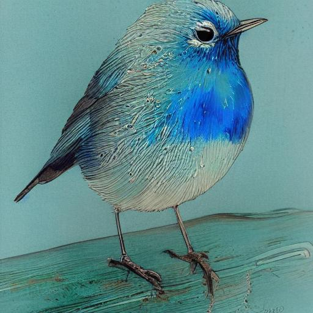

# Stable Diffusion 1.5 + Control Net (Canny)

This version was tested with [rocm 6.0](https://github.com/ROCmSoftwarePlatform/AMDMIGraphX/tree/rocm-6.0.0) revision.

## Console application

To run the console application, follow these steps below.

Setup python environment

```bash
# this will require the python venv to installed (e.g. apt install python3.8-venv)
python3 -m venv sd_venv
. sd_venv/bin/activate
```

Install dependencies

```bash
pip install -r requirements.txt
```

Use MIGraphX Python Module

```bash
export PYTHONPATH=/opt/rocm/lib:$PYTHONPATH
```

Get models with diffusers

```bash
python3 convert_stable_diffusion_controlnet_to_onnx.py \
    --model_path runwayml/stable-diffusion-v1-5 \
    --controlnet_path lllyasviel/sd-controlnet-canny \
    --output_path models/sd15-onnx \
    --fp16
```
*Note: `models/sd15-onnx` will be used in the scripts.*

Run the text-to-image script with the following example prompt and canny control image:

```bash
python txt2img.py --prompt "blue bird" --control_image bird_canny.png
```
*Note: The first run will compile the models and cache them to make subsequent runs faster.*

The result should look like this:



## Gradio application

Note: requires `Console application` to work

Install gradio dependencies

```bash
pip install -r gradio_requirements.txt
```

Usage

```bash
python gradio_app.py --prompt "blue bird" --control_image bird_canny.png
```

This will load the models (which can take several minutes), and when the setup is ready, starts a server on `http://127.0.0.1:7860`.
