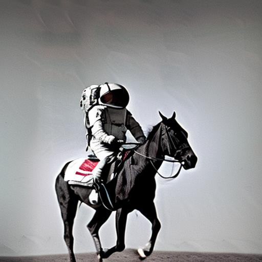

# Stable Diffusion 2.1

This version was tested with [rocm 5.7](https://github.com/ROCmSoftwarePlatform/AMDMIGraphX/tree/rocm-5.7.0) revision.

## Jupyter notebook

There is a dedicated step-by-step notebook. See [sd21.ipynb](./sd21.ipynb)

## Console application

To run the console application, follow these steps below.

Setup python environment

```bash
# this will require the python venv to installed (e.g. apt install python3.8-venv)
python3 -m venv sd_venv
. sd_venv/bin/activate
```

Install dependencies

```bash
pip install -r requirements.txt
```

Use MIGraphX Python Module

```bash
export PYTHONPATH=/opt/rocm/lib:$PYTHONPATH
```

Get models with optimum

```bash
optimum-cli export onnx --model stabilityai/stable-diffusion-2-1 models/sd21-onnx
```
*Note: `models/sd21-onnx` will be used in the scripts.*

Run the text-to-image script with the following example prompt and seed:

```bash
python txt2img.py --prompt "a photograph of an astronaut riding a horse" --seed 13 --output astro_horse.jpg
```
*Note: The first run will compile the models and cache them to make subsequent runs faster.*

The result should look like this:


