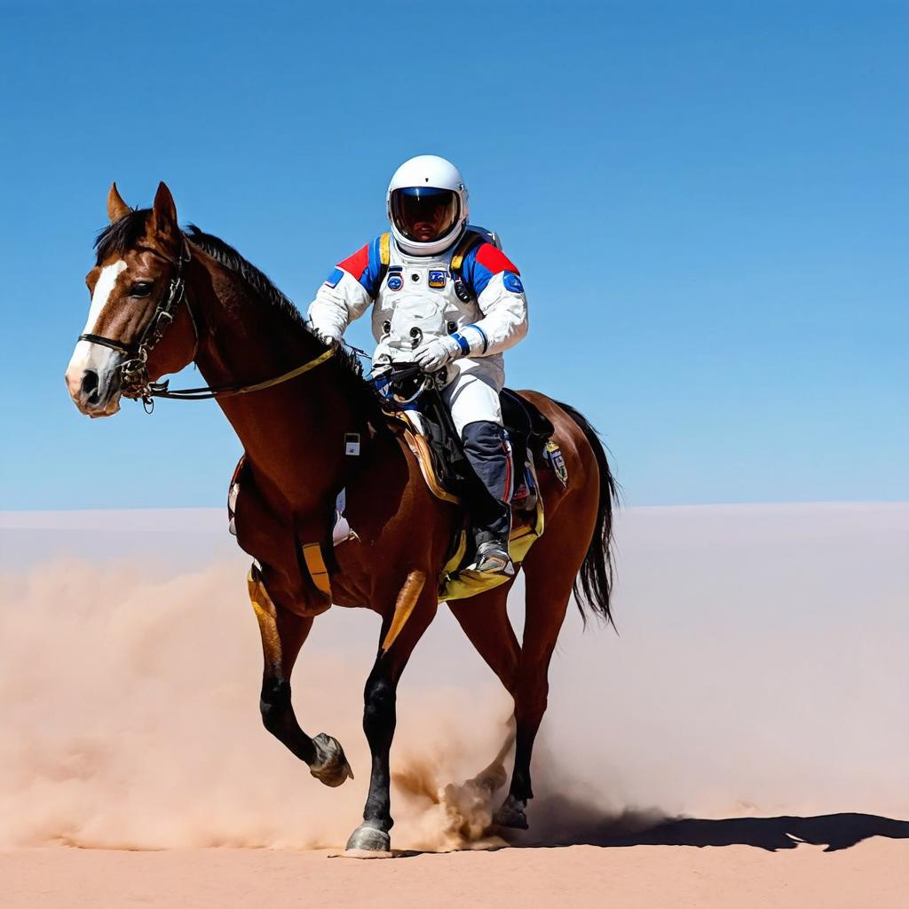

# Stable Diffusion 3

This version was tested with [rocm 6.2](https://github.com/ROCmSoftwarePlatform/AMDMIGraphX/tree/rocm-6.2.0) revision.

## Console application

To run the console application, follow these steps below.

Setup python environment

```bash
# this will require the python venv to installed (e.g. apt install python3.8-venv)
python3 -m venv sd_venv
. sd_venv/bin/activate
```

Install dependencies

```bash
pip install -r torch_requirements.txt
pip install -r requirements.txt
```

Use MIGraphX Python Module

```bash
export PYTHONPATH=/opt/rocm/lib:$PYTHONPATH
```

Get models:

Make sure you have permission to download and use stabilityai/stable-diffusion-3.
```bash
huggingface-cli login
```

Export the models to onnx. 
Currently, optimum does not have the changes required in their latest release. Please follow the steps to build optimum from scratch.
```bash
git clone --single-branch --branch main https://github.com/huggingface/optimum.git
cd optimum
make build_dist_install_tools
make build_dist
cd dist
pip install *.whl
cd ../..
```

Once optimum is built, use the following command to export the models:
```bash
optimum-cli export onnx --model stabilityai/stable-diffusion-3-medium-diffusers  models/sd3
```

Run the text-to-image script with the following example prompt and seed (optionally, you can change the batch size / number of images generated for that prompt)

```bash
MIGRAPHX_DISABLE_REDUCE_FUSION=1 python txt2img.py --prompt "a photograph of an astronaut riding a horse" --steps 50 --output astro_horse.jpg
```
> [!NOTE]
> The first run will compile the models and cache them to make subsequent runs faster. New batch sizes will result in the models re-compiling.*

The result should look like this:



