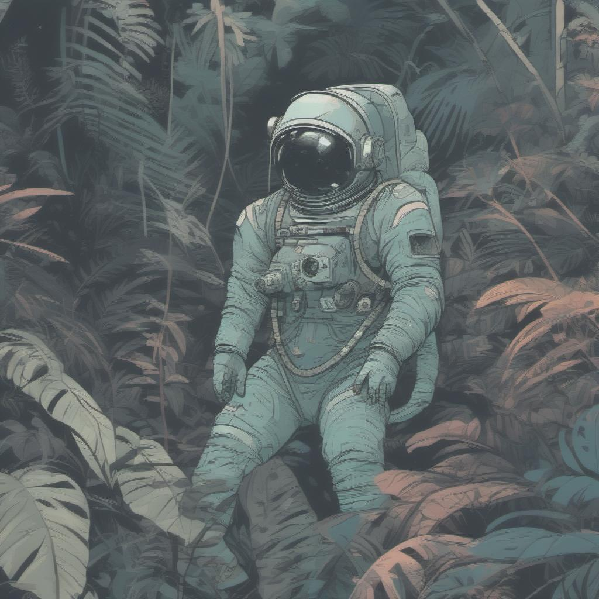

# Stable Diffusion XL

This version was tested with [rocm 6.0](https://github.com/ROCmSoftwarePlatform/AMDMIGraphX/tree/rocm-6.0.0) revision.

## Console application

To run the console application, follow these steps below.

Setup python environment

```bash
# this will require the python venv to installed (e.g. apt install python3.8-venv)
python3 -m venv sd_venv
. sd_venv/bin/activate
```

Install dependencies

```bash
pip install -U pip
pip install -r requirements.txt
# hip-python needs to be installed separately to not conflict with test packages
pip install -i https://test.pypi.org/simple hip-python
```

Use MIGraphX Python Module

```bash
export PYTHONPATH=/opt/rocm/lib:$PYTHONPATH
```

Get models with huggingface-cli

### Base version

```bash
huggingface-cli download stabilityai/stable-diffusion-xl-base-1.0 text_encoder/model.onnx text_encoder_2/model.onnx text_encoder_2/model.onnx_data unet/model.onnx unet/model.onnx_data vae_decoder/model.onnx --local-dir models/sdxl-1.0-base/ --local-dir-use-symlinks False
```

### Opt version

```bash
huggingface-cli download stabilityai/stable-diffusion-xl-base-1.0 vae_decoder/model.onnx --local-dir models/sdxl-1.0-base/ --local-dir-use-symlinks False
huggingface-cli download stabilityai/stable-diffusion-xl-1.0-tensorrt sdxl-1.0-base/clip.opt/model.onnx sdxl-1.0-base/clip2.opt/model.onnx sdxl-1.0-base/unetxl.opt/model.onnx sdxl-1.0-base/unetxl.opt/435d4c0a-2d32-11ee-8476-0242c0a80101 --local-dir models/ --local-dir-use-symlinks False
```

Convert CLIP models to expose "hidden_state" as output.

```bash
# clip.opt
python clip_modifier.py -i models/sdxl-1.0-base/clip.opt/model.onnx -o models/sdxl-1.0-base/clip.opt.mod/model.onnx

# clip2.opt
python clip_modifier.py -i models/sdxl-1.0-base/clip2.opt/model.onnx -o models/sdxl-1.0-base/clip2.opt.mod/model.onnx
```

### Turbo version

```bash
huggingface-cli download stabilityai/sdxl-turbo text_encoder/model.onnx text_encoder_2/model.onnx text_encoder_2/model.onnx_data unet/model.onnx unet/model.onnx_data vae_decoder/model.onnx --local-dir models/sdxl-turbo/ --local-dir-use-symlinks False
```

### Running txt2img

Run the text-to-image script with the following example prompt and seed:

Set `pipeline-type` based on the version of models you downloaded: `sdxl` for base, `sdxl-opt` for opt, `sdxl-turbo` for turbo

```bash
python txt2img.py --prompt "Astronaut in a jungle, cold color palette, muted colors, detailed, 8k" --seed 42 --output jungle_astro.jpg --pipeline-type <model-version>
```
> [!NOTE]
> The first run will compile the models and cache them to make subsequent runs faster.

The result should look like this:



## (Optional) Refiner

> [!IMPORTANT]
> requires `Console application` to work

Get models with huggingface-cli

> [!NOTE]
> Only the opt version provides an onnx model, but can be used for all 3 version (`sdxl`, `sdxl-opt`, `sdxl-turbo`)

```bash
huggingface-cli download stabilityai/stable-diffusion-xl-1.0-tensorrt sdxl-1.0-refiner/clip2.opt/model.onnx sdxl-1.0-refiner/unetxl.opt/model.onnx sdxl-1.0-refiner/unetxl.opt/6ed855ee-2d70-11ee-af8e-0242c0a80101 sdxl-1.0-refiner/unetxl.opt/6e186582-2d74-11ee-8aa7-0242c0a80102 --local-dir models/ --local-dir-use-symlinks False
```

Convert CLIP2 model to expose "hidden_state" as output.

```bash
# clip2.opt
python clip_modifier.py -i models/sdxl-1.0-refiner/clip2.opt/model.onnx -o models/sdxl-1.0-refiner/clip2.opt.mod/model.onnx
```

Run the text-to-image script with the following example prompt and seed:

Set `pipeline-type` based on which version of models you have: `sdxl` for base, `sdxl-opt` for opt, `sdxl-turbo` for turbo

```bash
python txt2img.py --prompt "Astronaut in a jungle, cold color palette, muted colors, detailed, 8k" --seed 42 --output refined_jungle_astro.jpg --pipeline-type <model-version> --use-refiner
```

## (Optional) FP16 Quantization

> [!IMPORTANT]
> requires `Console application` to work

Quantizing the StabilityAI VAE model produces NaNs in the output, so we need to download a modified version to fix this. Download and export the fp16 fixed version:

```bash
python vae_fp16.py
```

> [!NOTE]
> By default, the path being saved to is `models/sdxl-1.0-base/vae_decoder_fp16_fix/model.onnx`. This can be changed by passing in `--output=<sdxl-directory>/vae_decoder_fp16_fix/model.onnx`.

Run the same text-to-image script as before, except add `--fp16=all` to the command. For example:

```bash
python txt2img.py --prompt "Astronaut in a jungle, cold color palette, muted colors, detailed, 8k" --seed 42 --output jungle_astro.jpg --pipeline-type <model-version> --fp16=all
```

Using the original StabilityAI VAE is still possible while quantizing the rest of the pipeline to fp16. To do this, set the flag to `--fp16="clip,clip2,unetxl"`.

## Gradio application

> [!IMPORTANT]
> requires `Console application` to work

Install gradio dependencies

```bash
pip install -r gradio_requirements.txt
```

Usage

Set `pipeline-type` based on which version of models you have: `sdxl` for base, `sdxl-opt` for opt, `sdxl-turbo` for turbo

```bash
python gradio_app.py -p "Astronaut in a jungle, cold color palette, muted colors, detailed, 8k" --pipeline-type <model-version>
```

This will load the models (which can take several minutes), and when the setup is ready, starts a server on `http://127.0.0.1:7860`.
